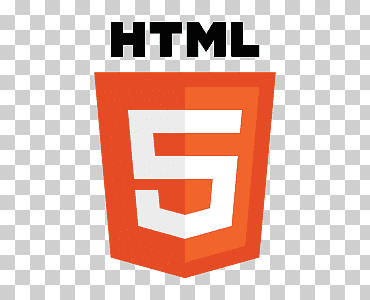

  
  <h2>Jose Santana</h2>
  
Hello everyone my name is Jose santana although I already knew, 
      I dream of being a great cybersecurity programmer and every day, 
      I fight to be someone in this world.

  

  
My experience in programming is quite small so far but I aspire to more. 
      These are some programming languages ​​that I master in the backend topic:

  
  
  

  
and these are some programing languages that I master in the frontend topic:

  
  
  

  

Thank you for my presentation and remember:  
    <b>"It doesn't matter how many times you fall, but how many times you get up"<b>

